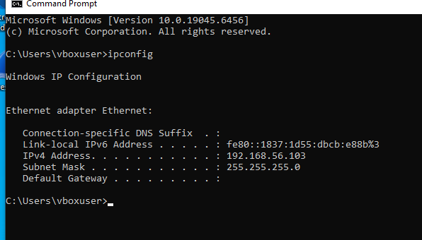
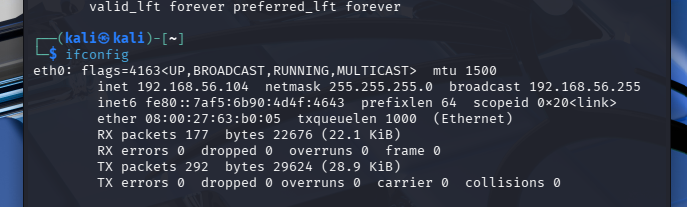
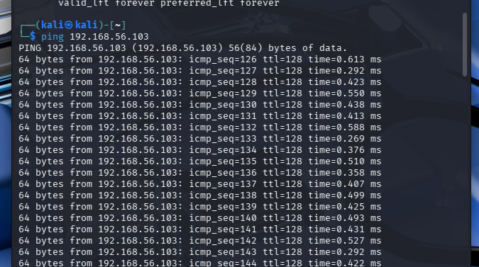
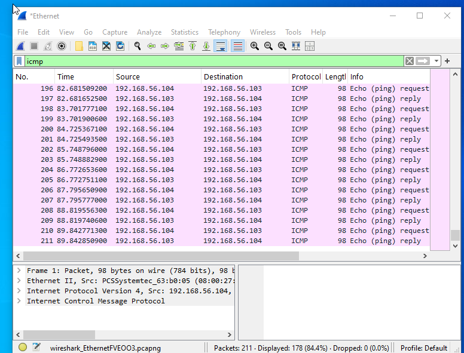

# 🔵 ICMP Traffic Analysis with Wireshark

## 📌 Overview
In this lab, I analysed ICMP (ping) traffic between two virtual machines using Wireshark. The goal was to understand how devices communicate on a network and how this traffic can be monitored for analysis and threat detection.

---

## 🎯 Objectives
- Test connectivity between two machines  
- Capture network traffic using Wireshark  
- Understand how ICMP (ping) works  
- Identify request and response packets  
- Gain visibility into network-level communication  

---

## 🖥️ Lab Setup

| Machine | Role | IP Address |
|--------|------|-----------|
| Kali Linux | Attacker / Sender | 192.168.56.104 |
| Windows 10 VM | Target / Receiver | 192.168.56.103 |

- Network Type: **Host-only Adapter**
- Tool Used: **Wireshark**

---

## ⚙️ Network Configuration

Initially, the virtual machines were on different networks, which prevented communication.

### ❌ Issue:
- Kali: `192.168.56.x`
- Windows: `10.0.2.x`
- Result: No connectivity

### ✅ Fix:
- Both VMs were configured to use a **Host-only network**
- This ensured both devices were on the same subnet


---

## 🚨 Firewall Adjustment

Windows Defender Firewall was blocking ICMP traffic.

### Fix:
- Enabled:
  - **File and Printer Sharing (Echo Request - ICMPv4-In)**

This allowed the Windows machine to respond to ping requests.

---

## 🧪 Steps Performed

### 1. Start Packet Capture
- Opened Wireshark on Windows
- Selected active network interface
- Started capturing traffic

---

### 2. Generate ICMP Traffic
From Kali Linux:

```
ping 192.168.56.103
```

This sends ICMP Echo Requests to the target machine.

---

### 3. Apply Wireshark Filter

```
icmp
```

This filter displays only ICMP traffic.

---

## 🔍 Observations

Each ping generated **two packets**:

### 📤 Echo Request
- Source: Kali (192.168.56.104)
- Destination: Windows (192.168.56.103)

👉 Meaning: *"Are you reachable?"*

---

### 📥 Echo Reply
- Source: Windows (192.168.56.103)
- Destination: Kali (192.168.56.104)

👉 Meaning: *"Yes, I am reachable."*

---

## 📡 Terminal Output Explanation

Example:
```
64 bytes from 192.168.56.103: icmp_seq=156 ttl=128 time=0.293 ms
```

- **64 bytes** → Packet size  
- **icmp_seq** → Packet sequence number  
- **ttl** → Time to live  
- **time** → Response time  

👉 This confirms successful communication between devices.

---

## 🧠 Key Learning Points

- ICMP is used to test connectivity between devices  
- Ping works using a request → reply mechanism  
- Devices must be on the same network (or routable)  
- Firewalls can block ICMP traffic  
- Wireshark allows visibility into real network communication  

---

## 🚨 Security Perspective

ICMP traffic can be used in both normal and malicious scenarios.

### Normal Behaviour:
- Regular request and reply pattern  
- Stable communication between known devices  

### Suspicious Behaviour:
- High volume of ICMP requests  
- One device pinging multiple devices  
- No replies (possible scanning activity)
---
## 🛡️ Defensive Actions

- Monitor ICMP traffic for unusual patterns
- Configure firewall rules to limit ICMP if necessary
- Use SIEM tools (e.g. Splunk) to detect abnormal behaviour
---

## 🧾 Conclusion

In this lab, ICMP traffic was successfully captured and analysed using Wireshark. The results demonstrated how devices communicate using echo requests and replies to verify connectivity. This exercise provided foundational knowledge in network monitoring and traffic analysis, which is essential for identifying suspicious activity in real-world environments.

---


## 🚀 Skills Demonstrated
- Network Traffic Analysis  
- Wireshark Usage  
- Troubleshooting Connectivity Issues  
- Understanding ICMP Protocol  
- Basic Threat Detection Awareness  
